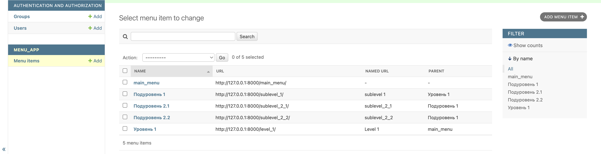

# uptrader_tz
Django приложение, которое реализует древовидное меню

### Тестовое задание

```
Задача :
Нужно сделать django app, который будет реализовывать древовидное меню, соблюдая следующие условия:
1) Меню реализовано через template tag
2) Все, что над выделенным пунктом - развернуто. Первый уровень вложенности под выделенным пунктом тоже развернут.
3) Хранится в БД.
4) Редактируется в стандартной админке Django
5) Активный пункт меню определяется исходя из URL текущей страницы
6 )Меню на одной странице может быть несколько. Они определяются по названию.
7) При клике на меню происходит переход по заданному в нем URL. URL может быть задан как явным образом, так и через named url.
8)На отрисовку каждого меню требуется ровно 1 запрос к БД
 Нужен django-app, который позволяет вносить в БД меню (одно или несколько) через админку, и нарисовать на любой нужной странице меню по названию.
 
 При выполнении задания из библиотек следует использовать только Django и стандартную библиотеку Python.
При решении тестового задания у вас не должно возникнуть вопросов. Если появляются вопросы, вероятнее всего, у вас недостаточно знаний.
Задание выложить на гитхаб.
```
### Запуск:
Операционная система: MacOS
Терминал: Zsh (Подходит также для Bash)
Cтек: Python3.12, SQLite, Django 5

1. Клонируем репозиторий: 
```
git clone git@github.com:islamkazproject/uptrader_tz.git
```

2. Устанавливаем виртуальное окружение:
```
python3 -m venv venv
```
3. Активируем:
```
source venv/bin/activate
```
4. Устанавливаем зависимости:
```
pip install -r requirements.txt
```
5. Выполняем миграции:
```
python3 manage.py makemigrations
python3 manage.py migrate
```
6. Создаем суперпользователя:
```
python3 manage.py createsuperuser
```
7. Запускаем сервер:
```
python3 manage.py runserver
```

### Скриншоты:

1. Admin панель django:
   
2. Отображение меню:
   
3. Запросы к БД:
   
   На отображение каждого меню уходит 1 запрос